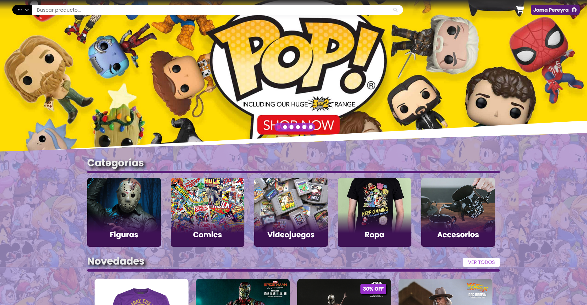

# StoreProject

Este proyecto representa la interfaz una tienda ficticia, fue desarrollado con fines de aprendizaje.
Muchas de las funcionalidades todavia no se encuentran implementadas.

Generado con [Angular CLI](https://github.com/angular/angular-cli) version 13.1.2.

## Servidor de Desarrollo

Ejecuando el comando `ng serve -o` de Angular CLI podemos levantar la app sobre `http://localhost:4200/`. La aplicacion se actualiza automaticamente si realiza algun cambio en el codigo fuente.

NOTA: la base de datos con la cual trabaja se encuentra alojada en un hosting de [Somee](https://somee.com) --> SQLServer.
